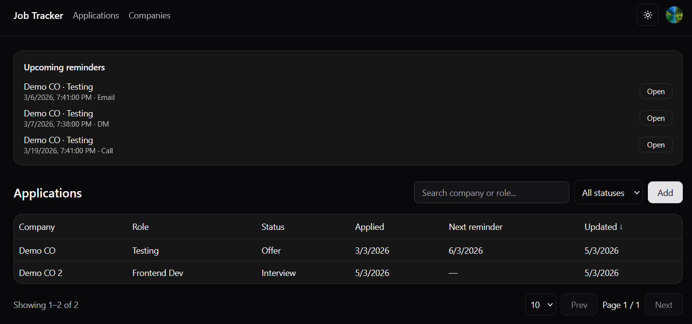
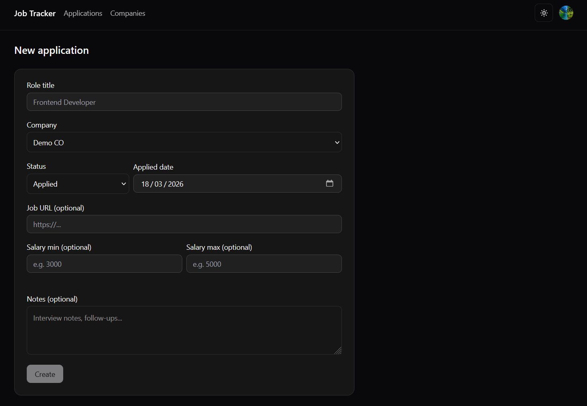
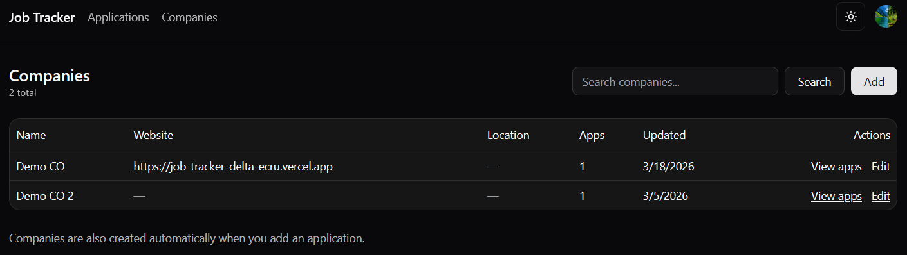

# Job Tracker

Live Demo: https://job-tracker-delta-ecru.vercel.app/  
Repo: https://github.com/Spyro7883/job-tracker

Job Tracker is a full-stack job application tracking app built with Next.js, TypeScript, Clerk, Prisma, and Postgres. It allows users to manage applications, companies, and follow-up reminders through a clean, production-style dashboard.

## Features

- Auth-protected dashboard with Clerk
- Applications CRUD
- Company management
- Search, filter, sort, and pagination
- Follow-up reminders with due date and type
- Upcoming reminders widget
- Next reminder preview inside the applications table
- Responsive UI
- Light / dark mode
- Playwright E2E testing

## Main Flows

### Applications
- Create a new application
- Edit role, company, status, date, salary range, job URL, and notes
- Search by role or company
- Filter by application status
- Sort and paginate application results

### Companies
- View companies in a dedicated page
- Create and edit companies
- Track website, location, and notes
- Jump from a company to its related applications

### Reminders
- Add reminders to an application
- Choose reminder type: Email, Call, DM, Other
- Mark reminders as done or undo them
- View upcoming reminders directly on the dashboard

## Tech Stack

- **Framework:** Next.js (App Router)
- **Language:** TypeScript
- **Styling:** Tailwind CSS
- **UI Components:** shadcn/ui
- **Authentication:** Clerk
- **ORM:** Prisma
- **Database:** Postgres
- **Forms:** React Hook Form + Zod
- **Tables:** TanStack Table
- **Testing:** Playwright
- **Deployment:** Vercel

## Screenshots





## Local Setup

### 1. Install dependencies

```bash
pnpm install
```

### 2. Create your local environment file

```bash
cp .env.example .env.local
```

Fill in the real values for your database and Clerk keys.

### 3. Generate Prisma client and run migrations

```bash
pnpm prisma generate
pnpm prisma migrate dev
```

### 4. Start the development server

```bash
pnpm dev
```

The app runs on:

```txt
http://localhost:3000
```

## Environment Variables

See `.env.example`.

Main variables used in the project:

- `DATABASE_URL`
- `DIRECT_URL`
- `NEXT_PUBLIC_CLERK_PUBLISHABLE_KEY`
- `CLERK_SECRET_KEY`
- `NEXT_PUBLIC_CLERK_SIGN_IN_URL`
- `NEXT_PUBLIC_CLERK_SIGN_UP_URL`
- `NEXT_PUBLIC_CLERK_AFTER_SIGN_IN_URL`
- `NEXT_PUBLIC_CLERK_AFTER_SIGN_UP_URL`

E2E testing variables:

- `E2E_TEST`
- `E2E_USER_ID`

## Testing

Run the Playwright E2E test with:

```bash
pnpm test:e2e
```

Current automated flow:

- bypass authentication in E2E mode
- create a new application
- confirm redirect to the detail page
- verify the created application appears in the dashboard table

## Deployment

The project is deployed on Vercel.

Production build flow:

```json
{
  "postinstall": "prisma generate",
  "vercel-build": "prisma generate && prisma migrate deploy && next build"
}
```

## Project Structure

```txt
app/
  app/
    applications/
    companies/
  sign-in/
  sign-up/
components/
  applications/
  companies/
  reminders/
  ui/
lib/
prisma/
tests/
```

## Notes

- Use `.env.example` to document all required environment variables without exposing secrets.

## License

This project is licensed under the MIT License.